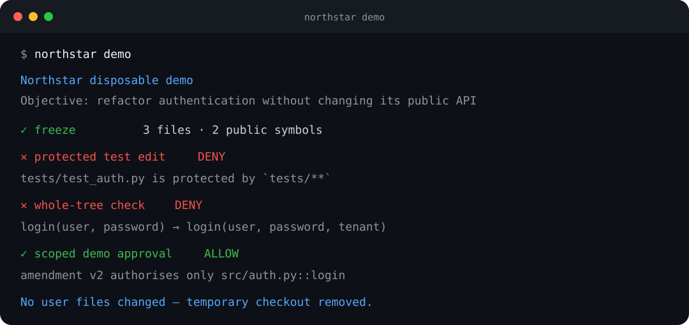
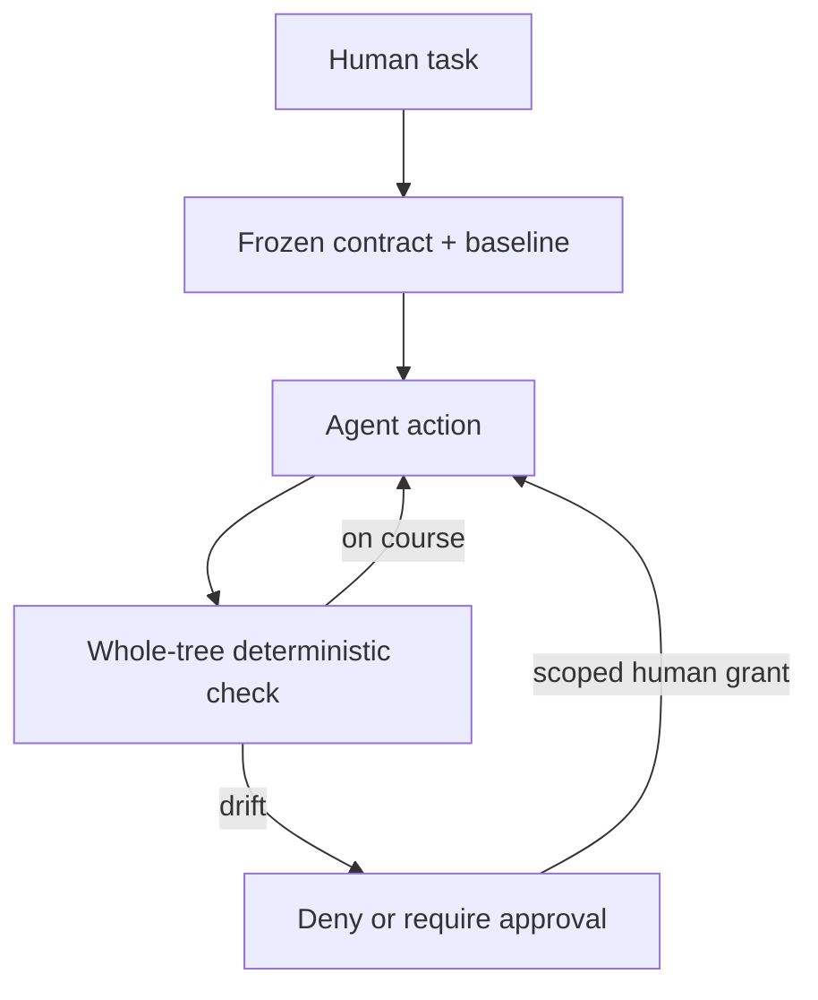

# Northstar

[](https://github.com/Jairogelpi/northstar/actions/workflows/ci.yml)
[](pyproject.toml)
[](#evidence-with-claim-boundaries)
[](pyproject.toml)
[](LICENSE)

**The deterministic intent-fidelity layer for coding agents.**

> Compaction remembers. Northstar verifies.

You ask an agent to *“refactor authentication, but do not change the public API.”*
Fifty steps later the API changed, the tests were edited to agree, and every local
decision looked reasonable. Northstar freezes the non-negotiable parts of the request
at step zero and checks the complete repository against that baseline after every
action.

It is not another prompt file, an LLM judge, or a command deny-list. The judge is a
deterministic process outside the agent conversation. It compares hashes, ASTs,
dependencies, module edges and optional test outcomes against a sealed authority.



## Try it in 60 seconds

Python 3.11+ is required. Until the first `0.2.x` PyPI release is published, install
the reviewed source directly from GitHub:

```bash
pipx install "git+https://github.com/Jairogelpi/northstar.git"
# or: uv tool install "git+https://github.com/Jairogelpi/northstar.git"

northstar demo
```

The demo creates a disposable project, blocks a protected test edit, catches a public
signature change, exercises a scoped approval and deletes the project. It does not
modify the current directory.

To govern a real repository, preview the exact contract before anything is written:

```bash
cd /path/to/project
northstar init "refactor authentication" --dry-run
northstar init "refactor authentication"
northstar doctor
```

`init` creates a human approval passphrase, freezes the baseline, stores the canonical
authority outside the working tree, writes reviewable mirrors, and wires Claude Code
and Codex. The objective is **not** silently interpreted as policy: the default profile
is shown explicitly. For task-derived constraints, use a reviewed task file:

```bash
northstar init --from-task TASK.md --dry-run
northstar init --from-task TASK.md
```

If a sentence cannot be compiled deterministically, `init` stops and prints
`NOT COMPILED`; after manual review, `--accept-uncompiled` records that conscious
decision. See the [five-minute quickstart](docs/quickstart.md) for agent trust,
approvals, diagnosis and clean uninstall.

## The core idea

Northstar turns intent drift into a versioned state comparison:

1. **Freeze at t=0.** Capture the public API, runtime dependencies, module graph,
   protected files and optional behavioural witness while the request is fresh.
2. **Check state, not edits.** Compare the whole tree with the original baseline.
   A sequence of individually plausible edits cannot launder a violation.
3. **Keep authority outside the tree.** Seal canonical state and mirror digests with
   HMAC; authenticate human amendments with an encrypted Ed25519 key.
4. **Widen only by grant.** The agent may request an exception, but only a human in a
   separate interactive terminal can approve the named grant.



The working copy contains readable mirrors; the operating-system data directory holds
the canonical bundle. Missing authority, mirror mismatch, corrupt signatures or broken
hook wiring is an `INTEGRITY_FAILURE`, never a silent pass.

## What makes it different

| Approach | Survives context compaction | Checks cumulative tree state | Deterministic verdict | External sealed authority | Scoped signed exceptions |
|---|:---:|:---:|:---:|:---:|:---:|
| Prompt / `AGENTS.md` instructions | No | No | No | No | No |
| Context summaries and memory | Partly | No | No | No | No |
| Command or tool-call firewall | Yes | No | Usually | No | Sometimes |
| LLM reviewer / semantic judge | Partly | Sometimes | No | No | Sometimes |
| **Northstar** | **Yes** | **Yes** | **Yes** | **Yes** | **Yes** |

This is a category comparison, not a claim that Northstar replaces every layer.
Instructions tell an agent what to do; sandboxes limit capability; tests verify
behaviour; Northstar preserves the task's declared invariants across the trajectory.
The detailed product boundary is in [positioning](docs/positioning.md).

## A small, reviewable contract

The contract is a deny-list, not a full specification. Anything it does not name is
free to change.

```yaml
objective: refactor authentication

constraints:
  protected_paths: ["tests/**"]
  public_api:
    change: forbidden
    additions: allowed
    scope: ["**/*.py"]
  dependencies:
    additions: forbidden
  module_graph:
    new_edges: allowed
  behavior:
    change: allowed
  commands:
    forbidden: ["git push*", "rm -rf*"]
  tools:
    unknown: approval_required
    read_only: []
    mutating: []
```

For behavioural compatibility, `northstar init --behavior` freezes the existing test
outcomes as an executable witness. It records behaviour that exists—including current
failures—not behaviour somebody hoped for.

Verdicts are explicit: `ALLOW`, `WARN_DRIFT`, `UNKNOWN`, `REQUIRE_APPROVAL` and
`DENY`. Unsupported or unparseable input becomes `UNKNOWN`; Northstar does not report
coverage it cannot prove.

## Everyday workflow

```bash
northstar status                 # objective + current verdict after any handoff
northstar check                  # deterministic full-tree check
northstar request --grant public_api:src/auth.py::login --reason "tenant agreed"
# human in another interactive terminal:
northstar approve REQUEST_ID
northstar receipt                # contract, decisions and amendment chain
northstar doctor --strict        # runtime, authority, mirrors, hooks and activity
northstar uninstall --agent all  # authenticated removal; preserves foreign settings
```

Claude Code is wired through `PreToolUse` and `PostToolUse`. Codex uses project hooks
plus `AGENTS.md`; a human must inspect and trust those hooks through `/hooks` before
relying on them. Post-state checks remain the backstop because no tool parser is a
complete security boundary.

## Evidence, with claim boundaries

| Evidence | Status | What it supports | What it does **not** support |
|---|---|---|---|
| Unit, integration and adversarial tests | Reproduced in CI | Implementation and integrity behaviour | Live-agent effectiveness |
| IntentDriftBench, 24 scripted paired trajectories | Reproduced in CI | 0% silent drift, 0% false blocks and 100% completion in this authored corpus | Independent or real-world rates |
| LiveAgentBench harness | Implemented and preflightable | Reproducible paired runs, blinding, annotation and bootstrap analysis | A result before real runs are published |
| Independent Claude Code/Codex study | **Pending** | Would support an external effectiveness estimate | Nothing is claimed yet |
| External adopter outcomes | **Pending** | Would support usability and retention claims | Stars are not effectiveness evidence |

Run the internal regression evidence yourself:

```bash
northstar bench
```

| Metric | Without runtime | With runtime |
|---|---:|---:|
| Hard-constraint violation rate | 91.7% | 20.8% |
| Silent drift rate | 91.7% | **0.0%** |
| False block rate | 0.0% | 0.0% |
| Human escalation rate | 0.0% | 4.2% |
| Task completion rate | 100.0% | 100.0% |

These are product-authored scripted trajectories, not an external estimate. The
publication rules, claim ladder and current ledger live in
[EVIDENCE.md](EVIDENCE.md). The live study protocol includes exact version pins,
commit-pinned clones, blinded outcome packets, independent labels and paired
confidence intervals:

```bash
northstar live-bench validate study.yml
northstar live-bench preflight study.yml --check-repositories
northstar live-bench plan study.yml --output preregistered-plan.json
# run -> packet -> independently label -> analyze
northstar live-bench report report.json --output report.md
```

See [LiveAgentBench](docs/live-agent-benchmark.md). The report renderer refuses a
report whose declared ground truth is not `independent_annotations`.

## Honest limits

- Northstar verifies declared, machine-checkable invariants; it does not prove
  subjective intent such as “keep the architecture simple.”
- Python surfaces use the AST. JavaScript, TypeScript, Go, Rust and Java extractors
  are heuristic and say so; unsupported surfaces become `UNKNOWN`.
- External state and seals are tamper-evident, not an OS sandbox. An unrestricted
  same-user process can ultimately reach the authority key. Use real isolation when
  defending against a malicious process; read [SECURITY.md](SECURITY.md).
- API, dependency and graph changes are generally detected after the edit; protected
  paths can be blocked before it. Git owns rollback.
- No independently labelled live-agent numbers are claimed today.

## Development and release status

```bash
python -m pip install -e ".[dev]"
ruff check src tests
python -m pytest --cov=northstar --cov-report=term-missing
northstar demo --json
northstar bench --json
```

CI tests Python 3.11–3.13 on Linux and Windows plus Python 3.12 on macOS, enforces 95%
branch coverage, reruns the scripted benchmark, and clean-installs the wheel. The
tag-driven workflow is prepared for PyPI Trusted Publishing, SBOMs, GitHub release
assets and build provenance. `0.2.0` remains unreleased until the one-time publisher
configuration and release smoke test are complete; see [releasing](docs/releasing.md).

Contributions are welcome, especially independently authored benchmark tasks,
compiler corpora and false-block reports. Start with
[CONTRIBUTING.md](CONTRIBUTING.md) and [the roadmap](ROADMAP.md).

## License

Apache-2.0
